# Architecture

## Purpose

This document explains `pd_scanner` as a developer-facing system:

- where execution starts
- how layers are separated
- how data moves end-to-end
- where multimodal extraction fits
- where to extend the system safely

## High-Level Project Layout

```text
pd_scanner/
├── cli/              # command-line entrypoints and subcommands
├── app/              # Streamlit GUI, state, UI helpers, workflow pages
├── core/             # config, lifecycle, services, pipeline, shared models
├── workflows/        # workflow-oriented orchestration
├── scanner/          # file discovery + extractor dispatch
├── extractors/       # format-specific extraction + OCR routing
├── detectors/        # rule/model detectors, validators, masking, merge logic
├── classifiers/      # group mapping, volume estimation, UZ assignment
├── reporting/        # CSV / JSON / Markdown writers
└── tests/            # regression and workflow-level tests
```

## Layer Model

### `cli`

Responsible for:

- building the CLI parser
- mapping subcommands to workflows
- building `AppConfig` from arguments
- printing compact workflow results

Main file:

- `pd_scanner/cli/main.py`

### `app/gui`

Responsible for:

- Streamlit bootstrap
- background execution state
- progress polling and live UI rendering
- workflow-specific pages

Main files:

- `pd_scanner/app/streamlit_app.py`
- `pd_scanner/app/state.py`
- `pd_scanner/app/ui_components.py`
- `pd_scanner/app/views/*`

### `core`

Responsible for:

- runtime configuration
- lifecycle management
- progress tracking
- shared pipeline
- core datamodels

Main files:

- `pd_scanner/core/config.py`
- `pd_scanner/core/models.py`
- `pd_scanner/core/lifecycle.py`
- `pd_scanner/core/services.py`
- `pd_scanner/core/pipeline.py`
- `pd_scanner/core/workflow_models.py`

### `workflows`

Responsible for:

- expressing user-visible workflows
- limiting file scope by workflow
- publishing previews and debug artifacts
- reusing extractor/detector/classifier logic without duplicating it

Examples:

- `full_scan_workflow.py`
- `pdf_workflow.py`
- `structured_workflow.py`
- `text_workflow.py`
- `image_workflow.py`
- `video_workflow.py`
- `detector_workflow.py`
- `reporting_workflow.py`

### `scanner`

Responsible for:

- recursive file discovery
- file-to-extractor dispatch

Main files:

- `pd_scanner/scanner/walker.py`
- `pd_scanner/scanner/file_dispatcher.py`

### `extractors`

Responsible for:

- parsing file formats
- normalizing output into `ExtractionResult`
- emitting `ExtractedChunk` objects
- invoking OCR through shared services
- handling embedded resources in multimodal formats

### `detectors`

Responsible for:

- running rule-based or future model-based entity detection
- validating identifiers
- reducing false positives with context logic
- masking sensitive values
- merging duplicate hits from multiple detectors

### `classifiers`

Responsible for:

- mapping entity types to PD groups
- estimating file volume
- assigning UZ level

### `reporting`

Responsible for:

- writing final reports
- converting `FileScanResult` + `ReportSummary` into deliverables

## End-to-End Data Flow

At the top level the system still behaves as:

1. entrypoint starts a workflow
2. workflow resolves file set
3. scanner selects extractor
4. extractor produces `ExtractionResult`
5. detector pipeline produces findings and aggregated entities
6. classifiers compute group flags, volume, UZ
7. reporting writes CSV / JSON / Markdown

## Mermaid: End-to-End Execution

```mermaid
flowchart LR
    A["CLI / Streamlit GUI"] --> B["Workflow"]
    B --> C["Scanner / Dispatcher"]
    C --> D["Extractor"]
    D --> E["ExtractionResult + ExtractedChunk[]"]
    E --> F["DetectionPipeline"]
    F --> G["Findings + DetectedEntity[]"]
    G --> H["Classifiers (group, volume, UZ)"]
    H --> I["FileScanResult / ReportSummary"]
    I --> J["CSV / JSON / Markdown reports"]
```



## Where Execution Starts

### CLI

Primary entrypoint:

- `python -m pd_scanner.cli.main ...`

Flow:

- `cli/main.py`
- subcommand dispatch
- workflow function
- `ScanService` or specialized workflow

### GUI

Primary entrypoint:

- `streamlit run pd_scanner/app/streamlit_app.py`

Flow:

- `app/streamlit_app.py`
- `BackgroundScanState`
- page renderer in `app/views/*`
- same workflow layer used by CLI

## Multimodal Extraction Integration

The system no longer treats extraction as “one file -> one flat text blob”.

Instead, some extractors now follow this internal sequence:

1. parse outer document structure
2. discover embedded resources
3. represent them as `EmbeddedResource`
4. route them through `EmbeddedResourceRouter`
5. optionally invoke `OCRService`
6. convert everything into unified `ExtractedChunk` objects

This is currently implemented for:

- PDF
- DOCX
- HTML

Examples:

- PDF text layer -> `pdf_text`
- embedded image in PDF -> `pdf_image_ocr`
- OCR of rasterized PDF page -> `pdf_page_ocr`
- DOCX paragraph -> `docx_paragraph`
- DOCX table cell -> `docx_table_cell`
- DOCX embedded image -> `docx_image_ocr`
- HTML visible text -> `html_text`
- HTML image alt/title -> `html_alt_text`
- HTML link text/metadata -> `html_link`
- HTML meta tag -> `html_metadata`
- HTML local image OCR -> `html_image_ocr`

The important architectural property is that downstream code still consumes the same normalized chunk abstraction.

## Role of `ExtractedChunk`

`ExtractedChunk` is the central handoff object between extraction and detection.

Fields:

- `text`: normalized extracted text fragment
- `source_type`: semantic origin of the chunk
- `source_path`: original file path
- `location`: page/row/paragraph/image metadata
- `row_index`: structured row index when applicable
- `columns`: structured column names when applicable
- `metadata`: extra extractor-specific context

Why it matters:

- detectors operate on chunks instead of raw files
- structured and unstructured formats share one detection interface
- GUI/debug previews can show chunk provenance
- multimodal extraction can add new chunk types without rewriting the pipeline

## Core Runtime Objects

Main result chain:

- `ExtractionResult`
- `RawFinding`
- `DetectedEntity`
- `FileScanResult`
- `ReportSummary`
- `WorkflowResult`

## Main Extension Points

### Add a new workflow

Go to:

- `pd_scanner/workflows/`
- `pd_scanner/cli/main.py`
- `pd_scanner/app/state.py`
- `pd_scanner/app/views/`

### Add a new file format

Go to:

- `pd_scanner/extractors/`
- `pd_scanner/scanner/file_dispatcher.py`
- relevant workflow inventory filters

### Add a new detector

Go to:

- `pd_scanner/detectors/base.py`
- `pd_scanner/detectors/entity_detector.py`
- `pd_scanner/detectors/model_detector.py`
- `pd_scanner/detectors/detection_pipeline.py`

### Modify progress / lifecycle

Go to:

- `pd_scanner/core/services.py`
- `pd_scanner/core/lifecycle.py`
- `pd_scanner/app/state.py`
- `pd_scanner/app/ui_components.py`

